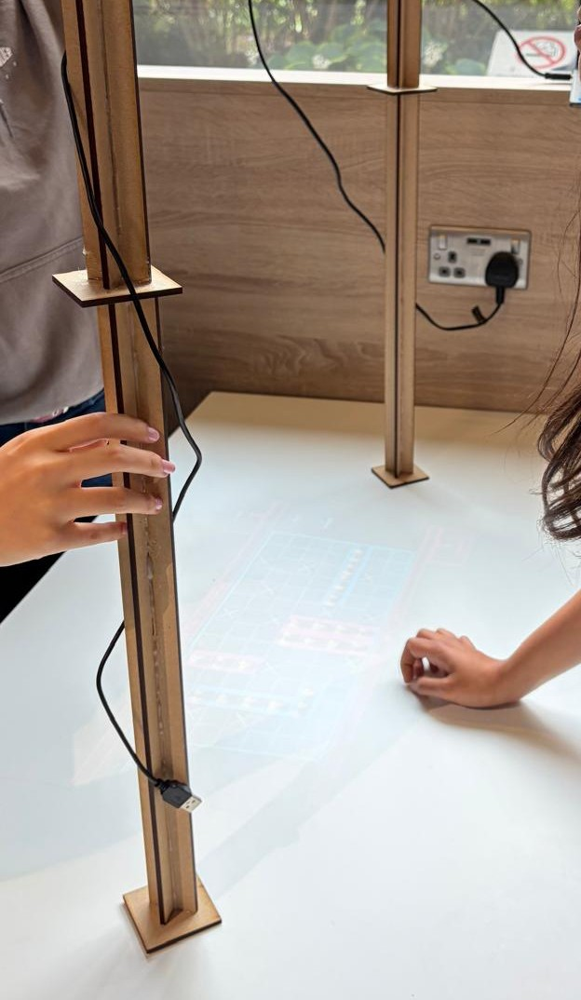

# Interactive Projected Battleships

A webcam-controlled, projected Battleships game developed as a collaborative university project. The system uses real-time hand tracking to allow players to interact with a projected game board without conventional physical controls.




## My contribution

I was responsible for the **core runtime architecture and integration of the project**. I brought the hand-tracking and game components together into a functioning real-time application, including the communication between the vision pipeline and game loop, gesture/event handling, input state management, game-mode architecture, and Battleships interaction logic.

The project was developed collaboratively. Other team members contributed substantially to the **hand-detection/landmarking pipeline** and the **visual/UI design and rendering**. I also modified and integrated components from these areas where necessary to connect them to the overall runtime architecture.

### System architecture

```text
Webcam
   ↓
Hand detection / landmarks
   ↓
Fingertip & gesture processing
   ↓
Game events
   ↓
Event queue
   ↓
Pygame game loop
   ↓
Game state / Battleships logic
   ↓
Projected display
```

This repository contains the integrated project rather than only my individual contribution, since the runtime depends on the interaction between all of these components.

## Features

* **Real-time hand tracking** — Uses a webcam and MediaPipe hand landmarks to track the player's hand and fingertip position.
* **Gesture-based interaction** — Converts fingertip movement into `TAP`, `DRAG`, and `RELEASE` events for controlling the game without a physical mouse or touchscreen.
* **Asynchronous vision pipeline** — Runs camera/vision processing separately from the main Pygame loop, communicating through a bounded event queue.
* **Interactive Battleships gameplay** — Supports board interaction, ship placement, turn handling, hits, misses and sunk ships through hand-controlled input.
* **Fullscreen projected display** — Designed for interaction with a projected game board rather than a conventional desktop interface.
* **Modular game architecture** — Separates input processing, game state, game modes and rendering, allowing different interactive modes to be developed within the same runtime.
* **Keyboard and mouse fallback** — Provides conventional input controls for testing and development when vision-based input is unavailable.
* **Camera–projector calibration prototype** — Includes a calibration tool for mapping camera coordinates to projected-screen coordinates using a homography transform.
* **Animated visual interface** — Includes an ocean-themed Battleships interface with animated visual elements and game-state feedback.

## Installation & Running

### Requirements:

Python 3.10+ (needs verification for the exact minor version)
A desktop environment with a working webcam and a fullscreen display/projector
A local Python environment with access to a GUI display
Install:

### Create and activate a virtual environment:

```text
python -m venv .venv
# Windows
.venv\Scripts\activate
# macOS/Linux
source .venv/bin/activate
```

### Install the required packages:

```text
python -m pip install --upgrade pip
pip install pygame opencv-python numpy mediapipe
```

This dependency list is inferred from the imports and should be verified against the exact target environment.

### Ensure the MediaPipe hand model is available:

The app will attempt to download hand_landmarker.task automatically if it is missing.
If the download fails, place hand_landmarker.task in the project root, next to main.py.

### Run the calibration step once if your camera/projector position changes:
```text
python calibration.py
```

This creates calibration.npy for the physical setup.

Run the app:
```text
python main.py
```

### Notes:

* The project expects a webcam on device index 0.
* It runs in fullscreen at 1280x720.
* The app is intended for a projector or monitor-based interactive surface and is not a console-only app.
* No environment variables or secret configuration are required by the current repo, but this should be re-checked if the project is later expanded.


## Limitations & Future Work

The prototype was developed within the constraints of a university project and presentation timeline. Several areas remain open for further development:

* **Camera–projector calibration:** A homography-based calibration system was prototyped to map camera coordinates to projected-screen coordinates, but was not fully integrated into the final runtime. Further work would be required to make the interaction robust to changes in camera/projector position and perspective.
* **Input latency:** The current vision-to-game pipeline has noticeable latency, particularly during continuous hand movement. Future work would investigate camera capture and processing rates, MediaPipe inference cost, event-queue behaviour, and unnecessary processing between the vision and rendering pipelines.
* **Robustness:** Further testing across different lighting conditions, camera positions and user hand positions would be needed to make the interaction system reliable outside the controlled presentation environment.
